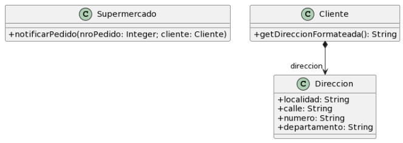

Link al cuadernillo: https://docs.google.com/document/d/1lUh8xz8foVFP4Y-gOHUkTNdBLmdag278sfaSR8iMooA/edit?tab=t.0

Para cada una de las siguientes situaciones, realice en forma iterativa los siguientes pasos:
(i) indique el mal olor,
(ii) indique el refactoring que lo corrige, 
(iii) aplique el refactoring, mostrando el resultado final (código y/o diseño según corresponda). 
Si vuelve a encontrar un mal olor, retorne al paso (i). 



Codigo Inicial

``` java
public class Supermercado {

   public void notificarPedido(long nroPedido, Cliente cliente) {
     String notificacion = MessageFormat
     .format(“Estimado cliente, se le informa que hemos recibido su pedido con número {0}, el cual será enviado a la dirección {1}”, 
      new Object[] { nroPedido, cliente.getDireccionFormateada() });

     // lo imprimimos en pantalla, podría ser un mail, SMS, etc..
    System.out.println(notificacion);
  }
}

public class Cliente {
   public String getDireccionFormateada() {
        return 
		this.direccion.getLocalidad() + “, ” +
		this.direccion.getCalle() + “, ” +
		this.direccion.getNumero() + “, ” +
		this.direccion.getDepartamento();
   }
}
```

1. i) Envidia de atts en Cliente. Procesa datos de Direccion, que deberia formatear Direccion en su toString().
ii) Extract Method de getDireccionFormateada() hacia la Clase Direccion.

``` java
public class Supermercado {

   public void notificarPedido(long nroPedido, Cliente cliente) {
     String notificacion = MessageFormat.format(“Estimado cliente, se le informa que hemos recibido su pedido con número {0}, el cual será enviado a la dirección {1}”, new Object[] { nroPedido, cliente.getDireccionFormateada() });

     // lo imprimimos en pantalla, podría ser un mail, SMS, etc..
    System.out.println(notificacion);
  }
}

public class Cliente {

  public String getDireccionFormateada() {
        return direccion.toString();
   }
}

public class Direccion {
  //...

  @Override
  public String toString() {
      return localidad + “, ” + calle + “, ” + numero + “, ” + departamento;
  }
}
```

2. i) Se mezcla logica de calculo con la presentacion de la informacion. Nombre de bad smell ??
ii) Se cambia firma del metodo para que retorne String. Que refactoring estoy aplicando ?
- Extract Method ?
- Separate Presentation from Business Logic ??

``` java
public class Supermercado {

  public String notificacion(long nroPedido, Cliente cliente) {
     
     return MessageFormat.format(“Estimado cliente, se le informa que hemos recibido su pedido con número {0}, el cual será enviado a la dirección {1}”
     , new Object [] { nroPedido, cliente.getDireccionFormateada() });
  }

  public void imprimirEnPantalla(String mensaje) {
    System.out.println(mensaje);
  }
}

public class Cliente {

  public String getDireccionFormateada() {
        return direccion.toString();
   }
}

public class Direccion {
  //...

  @Override
  public String toString() {
      return localidad + “, ” + calle + “, ” + numero + “, ” + departamento;
  }
}
```