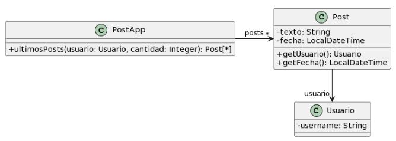

Codigo Inicial

``` java
/**
* Retorna los últimos N posts que no pertenecen al usuario user
*/
public List<Post> ultimosPosts(Usuario user, int cantidad) {
        
    List<Post> postsOtrosUsuarios = new ArrayList<Post>();

    for (Post post : this.posts) {
        if (!post.getUsuario().equals(user)) { //envidia
            postsOtrosUsuarios.add(post);
        }
    }
        
   // ordena los posts por fecha
   for (int i = 0; i < postsOtrosUsuarios.size(); i++) {

       int masNuevo = i;

       for(int j= i +1; j < postsOtrosUsuarios.size(); j++) {
           if (postsOtrosUsuarios.get(j).getFecha().isAfter(postsOtrosUsuarios.get(masNuevo).getFecha())) { //envidia
              masNuevo = j;
           }    
       }
      Post unPost = postsOtrosUsuarios.set(i,postsOtrosUsuarios.get(masNuevo));
      postsOtrosUsuarios.set(masNuevo, unPost);    
   }
        
    List<Post> ultimosPosts = new ArrayList<Post>();

    int index = 0;

    Iterator<Post> postIterator = postsOtrosUsuarios.iterator();

    while (postIterator.hasNext() &&  index < cantidad) {
        ultimosPosts.add(postIterator.next());
    }

    return ultimosPosts;
}
```

Entendiendo el contexto inicial:
+ El metodo tiene que retornar los ultimos N posts de la lista de posts que NO son del usuario "user".
+ PostApp contiene la lista de todos los Post.
+ Cada Post conoce al usuario creador

====== Malos olores ======

Metodo ultimosPost muy largo
- Multiples Extract Method

Nombre del metodo ultimosPost poco claro
- Rename Method

Se reinventa la rueda cada vez que se procesa informacion.
- Replace Loop with Pipeline

Comentarios que explican codigo porque no se entiende la logica.
 

.i) Metodo muy largo
.ii) Extract Method del primer for

``` java

public List<Post> postsQueNoSonDe (Usuario user) {
    List<Post> postsOtrosUsuarios = new ArrayList<Post>();

    for (Post post : this.posts) {
        if (!post.getUsuario().equals(user)) { //envidia
            postsOtrosUsuarios.add(post);
        }
    }

    return postsOtrosUsuarios;
}

public List<Post> ultimosPosts(Usuario user, int cantidad) {

    List<Post> postsOtrosUsuarios = new ArrayList<Post>();

    postsOtrosUsuarios = postsQueNoSonDe(user);

   // ordena los posts por fecha
   for (int i = 0; i < postsOtrosUsuarios.size(); i++) {

       int masNuevo = i;

       for(int j= i +1; j < postsOtrosUsuarios.size(); j++) {
           if (postsOtrosUsuarios.get(j).getFecha().isAfter(postsOtrosUsuarios.get(masNuevo).getFecha())) { //envidia
              masNuevo = j;
           }    
       }
      Post unPost = postsOtrosUsuarios.set(i,postsOtrosUsuarios.get(masNuevo));
      postsOtrosUsuarios.set(masNuevo, unPost);    
   }
        
    List<Post> ultimosPosts = new ArrayList<Post>();

    int index = 0;

    Iterator<Post> postIterator = postsOtrosUsuarios.iterator();

    while (postIterator.hasNext() &&  index < cantidad) {
        ultimosPosts.add(postIterator.next());
    }

    return ultimosPosts;
}
```

--- Este es el que mas duda me genera ---

.i) Envidia de atributos en la clase Post --> respuesta profe: NO.
.ii) Move Function ?? desde Post hacia Usuario.

``` java
Public Class Usuario {
    //...

    public boolean equals(Object user) {
        return this == user;
    }
}

Public Class Post {
    //...

    public boolean esDe(Usuario user) {
        return usuario.equals(user);
    }
}

Public Class PostApp {

    //...

    public List<Post> postsQueNoSonDe (Usuario user) {
        List<Post> postsOtrosUsuarios = new ArrayList<Post>();

        for (Post post : this.posts) {
            if (!post.esDe(user)) { //envidia
                postsOtrosUsuarios.add(post);
            }
        }

        return postsOtrosUsuarios;
    }

    public List<Post> ultimosPosts(Usuario user, int cantidad) {
            
    List<Post> postsOtrosUsuarios = new ArrayList<Post>();

    postsOtrosUsuarios = postsQueNoSonDe(user);

        // ordena los posts por fecha
        for (int i = 0; i < postsOtrosUsuarios.size(); i++) {

            int masNuevo = i;

            for(int j= i +1; j < postsOtrosUsuarios.size(); j++) {
                if (postsOtrosUsuarios.get(j).getFecha().isAfter(postsOtrosUsuarios.get(masNuevo).getFecha())) { //envidia
                    masNuevo = j;
                }    
            }
            Post unPost = postsOtrosUsuarios.set(i,postsOtrosUsuarios.get(masNuevo));
            postsOtrosUsuarios.set(masNuevo, unPost);    
        }
                
        List<Post> ultimosPosts = new ArrayList<Post>();

        int index = 0;

        Iterator<Post> postIterator = postsOtrosUsuarios.iterator();

        while (postIterator.hasNext() &&  index < cantidad) {
            ultimosPosts.add(postIterator.next());
        }

        return ultimosPosts;
    }
}
```

En realidad entre el anterior y este proximo estaria el olor del Temporary Field

.i) Reinventa la rueda en el metodo extraido
.ii) Replace Loop with Pipeline

``` java

//...

//...

Public Class PostApp {

    //...

    public List<Post> postsQueNoSonDe (Usuario user) {

        return posts.stream()
                .filter(p -> ! p.esDe(user))
                .collect(Collectors.toList());
    }

    public List<Post> ultimosPosts(Usuario user, int cantidad) {
            
        List<Post> postsOtrosUsuarios = new ArrayList<Post>();

        postsOtrosUsuarios = postsQueNoSonDe(user);

        // ordena los posts por fecha
        for (int i = 0; i < postsOtrosUsuarios.size(); i++) {

            int masNuevo = i;

            for(int j= i +1; j < postsOtrosUsuarios.size(); j++) {
                if (postsOtrosUsuarios.get(j).getFecha().isAfter(postsOtrosUsuarios.get(masNuevo).getFecha())) { //envidia
                    masNuevo = j;
                }    
            }
            Post unPost = postsOtrosUsuarios.set(i,postsOtrosUsuarios.get(masNuevo));
            postsOtrosUsuarios.set(masNuevo, unPost);    
        }
                
        List<Post> ultimosPosts = new ArrayList<Post>();

        int index = 0;

        Iterator<Post> postIterator = postsOtrosUsuarios.iterator();

        while (postIterator.hasNext() &&  index < cantidad) {
            ultimosPosts.add(postIterator.next());
        }

        return ultimosPosts;
    }
}
```

.i) Metodo muy largo 
.ii) extract method de ordenamiento de fecha

``` java

//...

//...

Public Class PostApp {

    //...

    public List<Post> postsQueNoSonDe (Usuario user) {

        return posts.stream()
                .filter(p -> ! p.esDe(user))
                .collect(Collectors.toList());
    }

    public void ordenarPorFecha(List<Post> postsOtrosUsuarios) {

        // ordena los posts por fecha
        for (int i = 0; i < postsOtrosUsuarios.size(); i++) {

            int masNuevo = i;

            for(int j= i +1; j < postsOtrosUsuarios.size(); j++) {
                if (postsOtrosUsuarios.get(j).getFecha().isAfter(postsOtrosUsuarios.get(masNuevo).getFecha())) { //envidia
                    masNuevo = j;
                }    
            }
            Post unPost = postsOtrosUsuarios.set(i,postsOtrosUsuarios.get(masNuevo));
            postsOtrosUsuarios.set(masNuevo, unPost);    
        }
    }

    public List<Post> ultimosPosts(Usuario user, int cantidad) {
            
        List<Post> postsOtrosUsuarios = new ArrayList<Post>();

        postsOtrosUsuarios = postsQueNoSonDe(user);

        this.ordenarPorFecha(postsOtrosUsuarios);

        List<Post> ultimosPosts = new ArrayList<Post>();

        int index = 0;

        Iterator<Post> postIterator = postsOtrosUsuarios.iterator();

        while (postIterator.hasNext() &&  index < cantidad) {
            ultimosPosts.add(postIterator.next());
        }

        return ultimosPosts;
    }
}
```

.i) Reiventa la rueda el metodo ordenarPorFecha
.ii) Replace Loop with Pipeline


``` java

//...

//...

Public Class PostApp {

    //...

    public List<Post> postsQueNoSonDe (Usuario user) {

        return posts.stream()
                .filter(p -> ! p.esDe(user))
                .collect(Collectors.toList());
    }

    public void ordenarPorFecha(List<Post> postsOtrosUsuarios) {

        postsOtrosUsuarios = postsOtrosUsuarios.stream()
                            .sorted((p1, p2) -> p1.getFecha().compareTo(p2.getFecha()))
                            .collect(Collectors.toList());
    }

    public List<Post> ultimosPosts(Usuario user, int cantidad) {
            
        List<Post> postsOtrosUsuarios = new ArrayList<Post>();
        postsOtrosUsuarios = postsQueNoSonDe(user);

        this.ordenarPorFecha(postsOtrosUsuarios);

        List<Post> ultimosPosts = new ArrayList<Post>();
        int index = 0;
        Iterator<Post> postIterator = postsOtrosUsuarios.iterator();
        while (postIterator.hasNext() &&  index < cantidad) {
            ultimosPosts.add(postIterator.next());
        }

        return ultimosPosts;
    }
}
```


.i) ultimosPosts sigue siendo largo
.ii) Extract method de la parte del while

``` java

//...

//...

Public Class PostApp {

    //...

    public List<Post> postsQueNoSonDe (Usuario user) {

        return posts.stream()
                .filter(p -> ! p.esDe(user))
                .collect(Collectors.toList());
    }

    public void ordenarPorFecha(List<Post> postsOtrosUsuarios) {

        postsOtrosUsuarios = postsOtrosUsuarios.stream()
                            .sorted((p1, p2) -> p1.getFecha().compareTo(p2.getFecha()))
                            .collect(Collectors.toList());
    }

    public List<Post> obtenerUltimosNPosts(List<Post> postsOtrosUsuarios, int cantidad) {

        int index = 0;
        Iterator<Post> postIterator = postsOtrosUsuarios.iterator();
        while (postIterator.hasNext() &&  index < cantidad) {
            ultimosPosts.add(postIterator.next());
        }
    }


    public List<Post> ultimosPosts(Usuario user, int cantidad) {
            
        List<Post> postsOtrosUsuarios = new ArrayList<Post>();
        postsOtrosUsuarios = postsQueNoSonDe(user);

        this.ordenarPorFecha(postsOtrosUsuarios);

        List<Post> ultimosPosts = new ArrayList<Post>();
        ultimosPosts = obtenerUltimosNPosts(postsOtrosUsuarios, cantidad);

        return ultimosPosts;
    }
}
```

.i) obtenerUltimosNPosts reinventa la rueda
.ii) REPLACE LOOP WITH PIPELINE

``` java

//...

//...

Public Class PostApp {

    //...

    public List<Post> postsQueNoSonDe (Usuario user) {

        return this.posts.stream()
                .filter(p -> ! p.esDe(user))
                .collect(Collectors.toList());
    }

    public void ordenarPorFecha(List<Post> postsOtrosUsuarios) {

        postsOtrosUsuarios = postsOtrosUsuarios.stream()
                            .sorted((p1, p2) -> p1.getFecha().compareTo(p2.getFecha()))
                            .collect(Collectors.toList());
    }

    public List<Post> obtenerUltimosNPosts(List<Post> postsOtrosUsuarios, int cantidad) {

        return postsOtrosUsuarios.stream()
                                .skip(postsOtrosUsuarios.size() - cantidad)
                                .collect(Collectors.toList());
    }


    public List<Post> ultimosPosts(Usuario user, int cantidad) {
            
        List<Post> postsOtrosUsuarios = new ArrayList<Post>();
        postsOtrosUsuarios = postsQueNoSonDe(user);

        this.ordenarPorFecha(postsOtrosUsuarios);

        List<Post> ultimosPosts = new ArrayList<Post>();
        ultimosPosts = obtenerUltimosNPosts(postsOtrosUsuarios, cantidad);

        return ultimosPosts;
    }
}
```

Que tendria que usar para seguir ?


