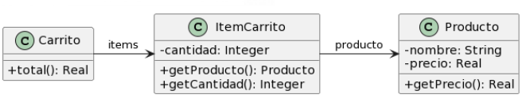

Link al cuadernillo: https://docs.google.com/document/d/1lUh8xz8foVFP4Y-gOHUkTNdBLmdag278sfaSR8iMooA/edit?tab=t.0




Codigo Inicial

``` java
public class Producto {
    private String nombre;
    private double precio;
    
    public double getPrecio() {
        return this.precio;
    }
}

public class ItemCarrito {
    private Producto producto;
    private int cantidad;
        
    public Producto getProducto() {
        return this.producto;
    }
    
    public int getCantidad() {
        return this.cantidad;
    }
}

public class Carrito {
    private List<ItemCarrito> items;
    
    public double total() {
        return this.items.stream()
        .mapToDouble(item -> 
        item.getProducto().getPrecio() * item.getCantidad())
        .sum();
    }
}
```

Carrito tiene una lista de items, falta el * en el UML.

- Replace Inline Code with Method Call: Usar getPrecioTotalItem() en Carrito.

- i) Nombre de metodo total() poco claro
- ii) Rename Method: Cambiar total() ---> precioTotalCarrito().

``` java
// ...
// ...

public class Carrito {
    private List<ItemCarrito> items;
    
    public double precioTotalCarrito() {
        return this.items.stream()
        .mapToDouble(item -> 
        item.getProducto().getPrecio() * item.getCantidad())
        .sum();
    }
}
```

- i) Envidia de atributos en metodo precioTotalCarrito()
- ii) Extract Method: crear getPrecioTotalItem() en ItemCarrito.

- DUDA: estoy extrayendo y moviendo hacia otra clase, sigue siendo extract method y o tambien el move method ? 


``` java
public class Producto {
    private String nombre;
    private double precio;
    
    public double getPrecio() {
        return this.precio;
    }
}

public class ItemCarrito {
    private Producto producto;
    private int cantidad;
        
    public Producto getProducto() {
        return this.producto;
    }
    
    public int getCantidad() {
        return this.cantidad;
    }

    public double getPrecioTotalItem() {
        return producto.getPrecio() * cantidad;
    }
}

public class Carrito {
    private List<ItemCarrito> items;
    
    public double precioTotalCarrito() {
        return this.items.stream()
        .mapToDouble(item -> item.getProducto().getPrecio() * item.getCantidad())
        .sum();
    }
}

```

.i) Codigo repetido en precioTotalCarrito()
.ii) Replace Inline Code with Method Call

``` java
public class Producto {
    private String nombre;
    private double precio;
    
    public double getPrecio() {
        return this.precio;
    }
}

public class ItemCarrito {
    private Producto producto;
    private int cantidad;
        
    public Producto getProducto() {
        return this.producto;
    }
    
    public int getCantidad() {
        return this.cantidad;
    }

    public double getPrecioTotalItem() {
        return producto.getPrecio() * cantidad;
    }
}

public class Carrito {
    private List<ItemCarrito> items;
    
    public double precioTotalCarrito() {
        return this.items.stream()
        .mapToDouble(item -> item.getPrecioTotalItem())
        .sum();
    }
}

```

Producto esta desde el comienzo como una clase anemica pero hay casos como este donde es inevitable.
El contexto de un problema te puede "obligar" a ceder estas cosas. 