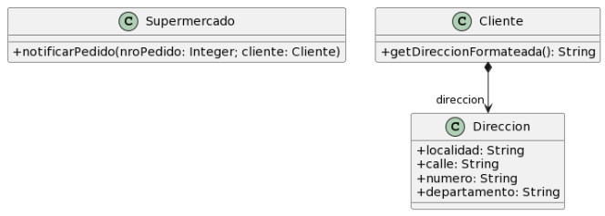

Link al cuadernillo: https://docs.google.com/document/d/1lUh8xz8foVFP4Y-gOHUkTNdBLmdag278sfaSR8iMooA/edit?tab=t.0



Codigo Inicial

``` java
public class Supermercado {

   public void notificarPedido(long nroPedido, Cliente cliente) {
     String notificacion = MessageFormat
     .format(“Estimado cliente, se le informa que hemos recibido su pedido con número {0}, el cual será enviado a la dirección {1}”, 
      new Object[] { nroPedido, cliente.getDireccionFormateada() });

     // lo imprimimos en pantalla, podría ser un mail, SMS, etc..
    System.out.println(notificacion);
  }
}

public class Cliente {
   public String getDireccionFormateada() {
        return 
		this.direccion.getLocalidad() + “, ” +
		this.direccion.getCalle() + “, ” +
		this.direccion.getNumero() + “, ” +
		this.direccion.getDepartamento();
   }
}
```

.i) Envidia de atts en Cliente. Procesa datos de Direccion, que deberia formatear Direccion en su toString().
.ii) Extract Method de getDireccionFormateada() hacia la Clase Direccion.

-misma duda con tema extract method ---> move method

``` java
public class Supermercado {

   public void notificarPedido(long nroPedido, Cliente cliente) {
     String notificacion = MessageFormat.format(“Estimado cliente, se le informa que hemos recibido su pedido con número {0}, el cual será enviado a la dirección {1}”, new Object[] { nroPedido, cliente.getDireccionFormateada() });

     // lo imprimimos en pantalla, podría ser un mail, SMS, etc..
    System.out.println(notificacion);
  }
}

public class Cliente {

  public String getDireccionFormateada() {
        return direccion.toString();
   }
}

public class Direccion {
  //...

  @Override
  public String toString() {
      return localidad + “, ” + calle + “, ” + numero + “, ” + departamento;
  }
}
```

.i) Se mezcla obtencion de la informacion con su presentacion. Nombre de bad smell ? Long method por hacer mas de una cosa a la vez ?
.ii) Se cambia metodo para que retorne String. Que refactoring estoy aplicando ?
- Extract Method ?
- Separate Presentation from Business Logic ??

Me falta un paso intermedio ?

``` java
public class Supermercado {

  public String notificacion(long nroPedido, Cliente cliente) {
     
     return MessageFormat.format(“Estimado cliente, se le informa que hemos recibido su pedido con número {0}, el cual será enviado a la dirección {1}”
     , new Object [] { nroPedido, cliente.getDireccionFormateada() });
  }

  public void imprimirEnPantalla(String mensaje) {
    System.out.println(mensaje);
  }
}

public class Cliente {

  public String getDireccionFormateada() {
        return direccion.toString();
   }
}

public class Direccion {
  //...

  @Override
  public String toString() {
      return localidad + “, ” + calle + “, ” + numero + “, ” + departamento;
  }
}
```