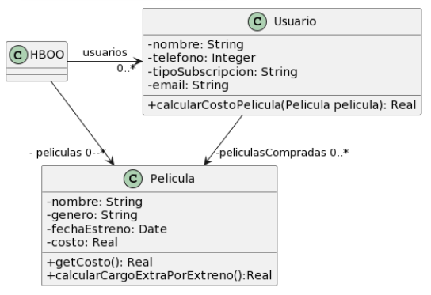

Link al cuadernillo: https://docs.google.com/document/d/1lUh8xz8foVFP4Y-gOHUkTNdBLmdag278sfaSR8iMooA/edit?tab=t.0



Codigo Inicial

``` java
public class Usuario {
    String tipoSubscripcion;
    // ...

    public void setTipoSubscripcion(String unTipo) {
   		this.tipoSubscripcion = unTipo;
    }
    
    public double calcularCostoPelicula(Pelicula pelicula) {
		double costo = 0;
		if (tipoSubscripcion=="Basico") {
			costo = pelicula.getCosto() + pelicula.calcularCargoExtraPorEstreno();
		}
		else if (tipoSubscripcion== "Familia") {
			costo = (pelicula.getCosto() + pelicula.calcularCargoExtraPorEstreno()) * 0.90;
		}
		else if (tipoSubscripcion=="Plus") {
			costo = pelicula.getCosto();
		}
		else if (tipoSubscripcion=="Premium") {
			costo = pelicula.getCosto() * 0.75;
		}
		return costo;
    }
}

public class Pelicula {
    LocalDate fechaEstreno;
    // ...

    public double getCosto() {
   	 return this.costo;
    }
    
    public double calcularCargoExtraPorEstreno(){
        // Si la Película se estrenó 30 días antes de la fecha actual, retorna un cargo de 0$, caso contrario, retorna un cargo extra de 300$
   	    return (ChronoUnit.DAYS.between(this.fechaEstreno, LocalDate.now()) ) > 30 ? 0 : 300;
    }
}

```

- i) Switch statements en el metodo calcularCostoPelicula de Usuario()
- ii) Replace Conditional with Polymorphism. Aca se cambian varias cosas al mismo tiempo, no solo por el agregado de de la interfaz y las clases, sino que tambien se cambia la variable en Usuario y el nombre de dos metodos.

``` java
public abstract class Suscripcion {
	
	public abstract double calcularCostoPelicula(Pelicula pelicula);
}

public class SuscripcionBasica extends Suscripcion {
	public double calcularCostoPelicula(Pelicula pelicula) {
		return pelicula.getCosto() + pelicula.calcularCargoExtraPorEstreno();
	}
}

public class SuscripcionFamilia  extends Suscripcion {

	public double calcularCostoPelicula(Pelicula pelicula) {
		return (pelicula.getCosto() + pelicula.calcularCargoExtraPorEstreno()) * 0.90;
	}
}

public class SuscripcionPlus  extends Suscripcion {
	
	public double calcularCostoPelicula(Pelicula pelicula) {
		return pelicula.getCosto();
	}
}

public class SuscripcionPremium extends Suscripcion {
	
	public double calcularCostoPelicula(Pelicula pelicula) {
		return pelicula.getCosto() * 0.75;
	}
}

public class Usuario {
    Suscripcion suscripcion;
    // ...

    public void setTipoSubscripcion(Suscripcion suscripcion) {
   		this.suscripcion = suscripcion;
    }
    
    public double getCostoPelicula(Pelicula pelicula) {
		return suscripcion.calcularCostoPelicula(pelicula);
    }
}

public class Pelicula {
    LocalDate fechaEstreno;
    // ...

    public double getCosto() {
   	 return this.costo;
    }
    
    public double calcularCargoExtraPorEstreno(){
        // Si la Película se estrenó 30 días antes de la fecha actual, retorna un cargo de 0$, caso contrario, retorna un cargo extra de 300$
   	    return (ChronoUnit.DAYS.between(this.fechaEstreno, LocalDate.now()) ) > 30 ? 0 : 300;
    }
}
```
- i) codigo repetido en las sublclases creadas
- ii) Move Method

``` java
public abstract class Suscripcion {
	
	public abstract double aplicarDescuento();

	public abstract double calcularCostoPelicula(Pelicula pelicula);
}

public abstract class SuscripcionNivelesBajos extends Suscripcion{
	
	public double calcularCostoPelicula(Pelicula pelicula) {
		return (pelicula.getCosto() + pelicula.calcularCargoExtraPorEstreno()) * this.aplicarDescuento();
	}
}

public abstract class SuscripcionNivelesAltos extends Suscripcion{
	
	public double calcularCostoPelicula(Pelicula pelicula) {
		return pelicula.getCosto() * this.aplicarDescuento();
	}
}

public class SuscripcionBasica extends SuscripcionNivelesBajos {

	public double aplicarDescuento() {
		return 1; 
	}
}

public class SuscripcionFamilia extends SuscripcionNivelesBajos{

	public double aplicarDescuento() {
		return 0,9; 
	}
}

public class SuscripcionPlus extends SuscripcionNivelesAltos{

	public double aplicarDescuento() {
		return 1;
	}
}

public class SuscripcionPremium extends SuscripcionNivelesAltos{
	
	public double aplicarDescuento() {
		return 0,75; 
	}
}

public class Usuario {
    Suscripcion suscripcion;
    // ...

    public void setTipoSubscripcion(Suscripcion suscripcion) {
   		this.suscripcion = suscripcion;
    }
    
    public double getCostoPelicula(Pelicula pelicula) {
		return suscripcion.calcularCostoPelicula(pelicula);
    }
}

public class Pelicula {
    LocalDate fechaEstreno;
    // ...

    public double getCosto() {
   	 return this.costo;
    }
    
    public double calcularCargoExtraPorEstreno(){
        // Si la Película se estrenó 30 días antes de la fecha actual, retorna un cargo de 0$, caso contrario, retorna un cargo extra de 300$
   	    return (ChronoUnit.DAYS.between(this.fechaEstreno, LocalDate.now()) ) > 30 ? 0 : 300;
    }
}
```


i) metodo calcularCargoExtraPorEstreno() es poco claro. Tiene comentario para que se entienda que hace.
ii) Extract Method


``` java
// ...
// ...
// ...
// ...


public class Pelicula {
    private LocalDate fechaEstreno;
    // ...

    public double getCosto() {
   	 return this.costo;
    }
    
	public boolean seEstrenoHaceMasDe (int dias) {
		return ChronoUnit.DAYS.between(this.fechaEstreno, LocalDate.now()) > dias;
	}

    public double calcularCargoExtraPorEstreno(){
        // Si la Película se estrenó 30 días antes de la fecha actual, retorna un cargo de 0$, caso contrario, retorna un cargo extra de 300$
   	    return (ChronoUnit.DAYS.between(this.fechaEstreno, LocalDate.now()) ) > 30 ? 0 : 300;
    }
}

```

i) se repite codigo por el cambio anterior
ii) Replace Inline Code with Method Call


``` java
// ...
// ...
// ...
// ...


public class Pelicula {
    private LocalDate fechaEstreno;
    // ...

    public double getCosto() {
   	 return this.costo;
    }
    
	public boolean seEstrenoHaceMasDe (int dias) {
		return ChronoUnit.DAYS.between(this.fechaEstreno, LocalDate.now()) > dias;
	}

    public double calcularCargoExtraPorEstreno(){
   	    return (seEstrenoHaceMasDe(30) ? 0 : 300);
    }
}

```
