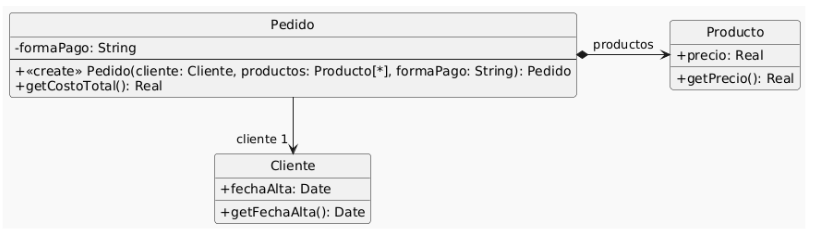

Se tiene el siguiente modelo de un sistema de pedidos y la correspondiente implementación.



``` java
01: public class Pedido {
02:  private Cliente cliente;
03:  private List<Producto> productos;
04:  private String formaPago;
05:  public Pedido(Cliente cliente, List<Producto> productos, String formaPago) {
06:     if (!"efectivo".equals(formaPago)
07:        && !"6 cuotas".equals(formaPago)
08:        && !"12 cuotas".equals(formaPago)) {
09:          throw new Error("Forma de pago incorrecta");
10:    }
11:    this.cliente = cliente;
12:    this.productos = productos;
13:    this.formaPago = formaPago;
14:   }
15:   public double getCostoTotal() {
16:     double costoProductos = 0;
17:     for (Producto producto : this.productos) {
18:       costoProductos += producto.getPrecio();
19:     }
20:     double extraFormaPago = 0;
21:     if ("efectivo".equals(this.formaPago)) {
22:       extraFormaPago = 0;
23:     } else if ("6 cuotas".equals(this.formaPago)) {
24:       extraFormaPago = costoProductos * 0.2;
25:     } else if ("12 cuotas".equals(this.formaPago)) {
26:       extraFormaPago = costoProductos * 0.5;
27:     }
28:     int añosDesdeFechaAlta = Period.between(this.cliente.getFechaAlta(), LocalDate.now()).getYears();
29:     // Aplicar descuento del 10% si el cliente tiene más de 5 años de antiguedad
30:     if (añosDesdeFechaAlta > 5) {
31:       return (costoProductos + extraFormaPago) * 0.9;
32:     }
33:     return costoProductos + extraFormaPago;
34:   }
35: }
36: public class Cliente {
37:   private LocalDate fechaAlta;
38:   public LocalDate getFechaAlta() {
39:     return this.fechaAlta;
40:   }
41: }
42: public class Producto {
43:   private double precio;
44:   public double getPrecio() {
45:     return this.precio;
46:   }
47: }
```

Tareas:
Dado el código anterior, aplique únicamente los siguientes refactoring:
Replace Loop with Pipeline (líneas 16 a 19)
Replace Conditional with Polymorphism (líneas 21 a 27)
Extract method y move method (línea 28)
Extract method y replace temp with query (líneas 28 a 33)
Realice el diagrama de clases del código refactorizado.


Replace Loop with Pipeline (líneas 16 a 19)

``` java
01: public class Pedido {
02:  private Cliente cliente;
03:  private List<Producto> productos;
04:  private String formaPago;

05:  public Pedido(Cliente cliente, List<Producto> productos, String formaPago) {
06:     if (!"efectivo".equals(formaPago)
07:        && !"6 cuotas".equals(formaPago)
08:        && !"12 cuotas".equals(formaPago)) {
09:          throw new Error("Forma de pago incorrecta");
10:    }
11:    this.cliente = cliente;
12:    this.productos = productos;
13:    this.formaPago = formaPago;
14:   }

15:   public double getCostoTotal() {

16:     double costoProductos = this.producto.stream()
                                .mapToDouble(p -> p.getPrecio());
                                .sum();

20:     double extraFormaPago = 0;
21:     if ("efectivo".equals(this.formaPago)) {
22:       extraFormaPago = 0;
23:     } else if ("6 cuotas".equals(this.formaPago)) {
24:       extraFormaPago = costoProductos * 0.2;
25:     } else if ("12 cuotas".equals(this.formaPago)) {
26:       extraFormaPago = costoProductos * 0.5;
27:     }
28:     int añosDesdeFechaAlta = Period.between(this.cliente.getFechaAlta(), LocalDate.now()).getYears();
29:     // Aplicar descuento del 10% si el cliente tiene más de 5 años de antiguedad
30:     if (añosDesdeFechaAlta > 5) {
31:       return (costoProductos + extraFormaPago) * 0.9;
32:     }
33:     return costoProductos + extraFormaPago;
34:   }
35: }

36: public class Cliente {
37:   private LocalDate fechaAlta;
38:   public LocalDate getFechaAlta() {
39:     return this.fechaAlta;
40:   }
41: }

42: public class Producto {
43:   private double precio;
44:   public double getPrecio() {
45:     return this.precio;
46:   }
47: }
```

Replace Conditional with Polymorphism (líneas 21 a 27)

- DUDA: lo estoy aplicando bien ??

1. creo la jerarquia
2. creo el metodo en cada subclase con el comportamiento condicional del codigo original
3. En la clase Pedido 
- cambio tipo de la vi formaPago de String a formaDePago
- adapto constructor

``` java
public abstract class formaDePago {

    public abstract double cargoExtra (double costoProductos) {}
}

public class efectivo extends formaDePago {
    public double cargoExtra (double costoProductos) {
        return 0;
    }
}

public class cuotas6 extends formaDePago {
    public double cargoExtra (double costoProductos) {
        return costoProductos * 0.2;
    }
}

public class cuotas12 extends formaDePago {
    public double cargoExtra (double costoProductos) {
        return costoProductos * 0.5;
    }
}


01: public class Pedido {
02:  private Cliente cliente;
03:  private List<Producto> productos;
04:  private formaDePago formaPago;

05:  public Pedido(Cliente cliente, List<Producto> productos, formaDePago formaPago) {
11:    this.cliente = cliente;
12:    this.productos = productos;
13:    this.formaPago = formaPago;
14:   }

15:   public double getCostoTotal() {

16:     double costoProductos = this.producto.stream()
                                .mapToDouble(p -> p.getPrecio());
                                .sum();

20:     double extraFormaPago = this.formaPago.cargoExtra(costoProductos);

28:     int añosDesdeFechaAlta = Period.between(this.cliente.getFechaAlta(), LocalDate.now()).getYears();
29:     // Aplicar descuento del 10% si el cliente tiene más de 5 años de antiguedad
30:     if (añosDesdeFechaAlta > 5) {
31:       return (costoProductos + extraFormaPago) * 0.9;
32:     }
33:     return costoProductos + extraFormaPago;
34:   }
35: }

36: public class Cliente {
37:   private LocalDate fechaAlta;
38:   public LocalDate getFechaAlta() {
39:     return this.fechaAlta;
40:   }
41: }

42: public class Producto {
43:   private double precio;
44:   public double getPrecio() {
45:     return this.precio;
46:   }
47: }
```

Extract method (línea 28)
- Lo extraigo y reemplazo variable temporal por el llamado.

``` java
// ...
// ...


01: public class Pedido {
02:  private Cliente cliente;
03:  private List<Producto> productos;
04:  private formaDePago formaPago;

05:  public Pedido(Cliente cliente, List<Producto> productos, formaDePago formaPago) {
11:    this.cliente = cliente;
12:    this.productos = productos;
13:    this.formaPago = formaPago;
14:   }

      public int añosDesdeFechaAlta () {
        return Period.between(this.cliente.getFechaAlta(), LocalDate.now()).getYears();
      }

15:   public double getCostoTotal() {

16:     double costoProductos = this.producto.stream()
                                .mapToDouble(p -> p.getPrecio());
                                .sum();

20:     double extraFormaPago = this.formaPago.cargoExtra(costoProductos);

28:     int añosDesdeFechaAlta = añosDesdeFechaAlta();
29:     // Aplicar descuento del 10% si el cliente tiene más de 5 años de antiguedad
30:     if (this.añosDesdeFechaAlta() > 5) {
31:       return (costoProductos + extraFormaPago) * 0.9;
32:     }
33:     return costoProductos + extraFormaPago;
34:   }
35: }

36: public class Cliente {
37:   private LocalDate fechaAlta;
38:   public LocalDate getFechaAlta() {
39:     return this.fechaAlta;
40:   }
41: }

42: public class Producto {
43:   private double precio;
44:   public double getPrecio() {
45:     return this.precio;
46:   }
47: }
```


move method del metodo anterior
- lo muevo a clase Cliente
- cambio llamado del metodo en la clase Pedido

``` java
// ...
// ...
01: public class Pedido {
02:  private Cliente cliente;
03:  private List<Producto> productos;
04:  private formaDePago formaPago;

05:  public Pedido(Cliente cliente, List<Producto> productos, formaDePago formaPago) {
11:    this.cliente = cliente;
12:    this.productos = productos;
13:    this.formaPago = formaPago;
14:   }

15:   public double getCostoTotal() {

16:     double costoProductos = this.producto.stream()
                                .mapToDouble(p -> p.getPrecio());
                                .sum();

20:     double extraFormaPago = this.formaPago.cargoExtra(costoProductos);

28:     int añosDesdeFechaAlta = this.cliente.añosDesdeFechaAlta();

29:     // Aplicar descuento del 10% si el cliente tiene más de 5 años de antiguedad
30:     if (añosDesdeFechaAlta > 5) {
31:       return (costoProductos + extraFormaPago) * 0.9;
32:     }
33:     return costoProductos + extraFormaPago;
34:   }
35: }

36: public class Cliente {
37:   private LocalDate fechaAlta;

38:   public LocalDate getFechaAlta() {
39:     return this.fechaAlta;
40:   }
      
      public int añosDesdeFechaAlta () {
        return Period.between(this.fechaAlta, LocalDate.now()).getYears();
      }
41: }

42: public class Producto {
43:   private double precio;
44:   public double getPrecio() {
45:     return this.precio;
46:   }
47: }
```

Extract method y replace temp with query (líneas 28 a 33)

1. Extract method

``` java
// ...
// ...
01: public class Pedido {
02:  private Cliente cliente;
03:  private List<Producto> productos;
04:  private formaDePago formaPago;

05:  public Pedido(Cliente cliente, List<Producto> productos, formaDePago formaPago) {
11:    this.cliente = cliente;
12:    this.productos = productos;
13:    this.formaPago = formaPago;
14:   }

     public double aplicaDescuentoDel10 (double costoProductos, double extraFormaPago) {

        if (this.cliente.añosDesdeFechaAlta() > 5) {
            return (costoProductos + extraFormaPago) * 0.9;
        }

        return costoProductos + extraFormaPago;
     }


15:   public double getCostoTotal() {

16:     double costoProductos = this.producto.stream()
                                .mapToDouble(p -> p.getPrecio());
                                .sum();

20:     double extraFormaPago = this.formaPago.cargoExtra(costoProductos);

33:     return this.aplicaDescuentoDel10(costoProductos, extraFormaPago);

34:   }

35: }

36: public class Cliente {
37:   private LocalDate fechaAlta;

38:   public LocalDate getFechaAlta() {
39:     return this.fechaAlta;
40:   }
      
      public int añosDesdeFechaAlta () {
        return Period.between(this.fechaAlta, LocalDate.now()).getYears();
      }
41: }

42: public class Producto {
43:   private double precio;
44:   public double getPrecio() {
45:     return this.precio;
46:   }
47: }
```